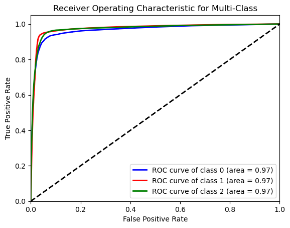
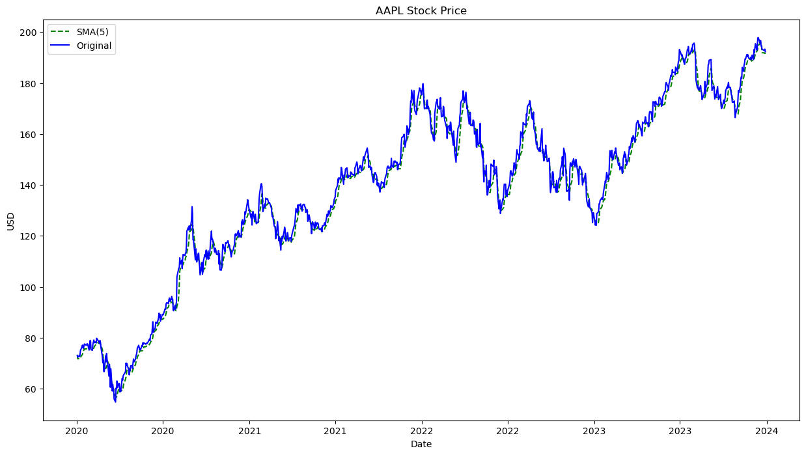
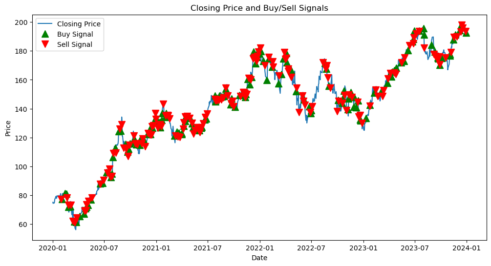
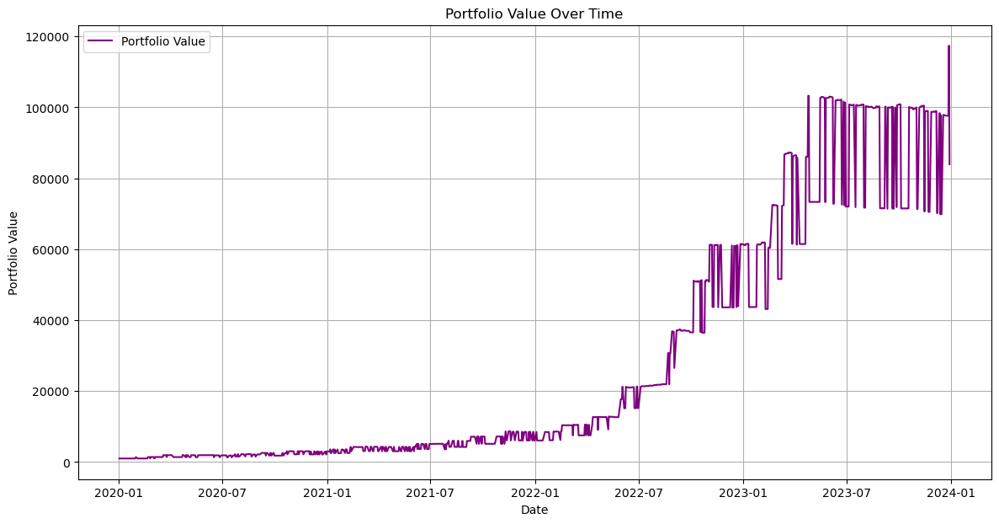

 
# **Stock Sentiment Analysis**

## **Introduction**

This project explores the application of  sentiment analysis techniques to enhance stock trading strategies. It combines natural language processing (NLP) with financial market data to develop and evaluate a sentiment-adjusted trading approach. Key aspects covered include data collection, sentiment analysis, model development, strategy implementation, performance evaluation, and actionable recommendations.

 
## Project Structure

```
sentiment-analysis-for-stock-trading/
│
├── data/
│   ├── stock_tweets.csv
│   └── stock_yfinance_data.csv
│
├── models/
│   ├── sentiment_model.pkl
│   └── trading_strategy.py
│
├── notebooks/
│   └── stock_sentiment_analysis.ipynb
│
├── src/
│   ├── data_processing.py
│   ├── sentiment_analysis.py
│   └── model_evaluation.py
│
├── README.md
├── requirements.txt
└── LICENSE.txt
```
## Installation

1. **Clone the repository:**
   ```sh
   git clone https://github.com/love-mishra/Stock-Sentiment-Analysis.git
   cd Stock-Sentiment-analysis
   ```

2. **Create a virtual environment and install dependencies:**
   ```sh
   python3 -m venv venv
   source venv/bin/activate  # On Windows use `venv\Scripts\activate`
   pip install -r requirements.txt
   ```

3. **Set up necessary API keys:**

   - **New York Times API Key:** Sign up for a key at [New York Times Developer Portal](https://developer.nytimes.com/apis).
   - **Yahoo Finance API Key:** Sign up for a key at [Yahoo Finance API](https://www.yahoofinanceapi.com/).

   Create a `.env` file in the root directory and add your API keys:
   ```plaintext
   NYT_API_KEY=your_nyt_api_key
   YAHOO_FINANCE_API_KEY=your_yahoo_finance_api_key
   ```

## Usage

### Data Collection

1. **Scrape News Headlines from Yahoo Finance:**
   ```sh
   python scripts/scrape_yahoo_finance.py
   ```

2. **Fetch Articles from New York Times API:**
   ```sh
   python scripts/fetch_nyt_articles.py
   ```

### Sentiment Analysis

 
   `

### Stock Data Retrieval

1. **Fetch Historical Stock Data using Yahoo Finance API:**
   ```sh
   python scripts/stock_news.py
   ```

### Data Integration

1. **Merge Sentiment Scores with Stock Data:**
   ```sh
   python scripts/stock_data.py
   ```

### Model Training and Evaluation

1. **Train Sentiment Prediction Model (Random Forest Classifier):**
   ```sh
   python scripts/train_sentiment_model.py
   ```

2. **Generate Trading Signals:**
   ```sh
   python scripts/generate_signals.py
   ```

3. **Evaluate Trading Strategy Performance:**
   ```sh
   python scripts/evaluate_strategy.py
   ```

 

 

 

 
 

### **Objective**
The primary objective of this study is to investigate how sentiment analysis of financial news headlines can be leveraged to improve trading decisions. By integrating sentiment insights with historical stock price data, the aim is to develop a robust trading strategy capable of outperforming traditional approaches.

### **Methodology**
- **Data Collection:** Financial news headlines were sourced from Yahoo Finance and the New York Times API for a select group of stocks. Historical stock price data was obtained using the Yahoo Finance API.
  
- **Sentiment Analysis:** Utilized NLP libraries such as NLTK (VADER) and TextBlob to analyze sentiment polarity (positive, neutral, negative) of news headlines.
  
- **Modeling:** Built a Random Forest Classifier to predict sentiment labels based on headline content. Cross-validation and evaluation metrics (Accuracy, Precision, Recall, F1-Score, ROC AUC) were used to assess model performance.

- **Trading Strategy:** Developed a sentiment-adjusted moving average strategy (SAMA) combining sentiment scores with technical analysis indicators (e.g., SMA). Simulated trading signals were generated based on sentiment polarity and SMA crossovers.

- **Performance Evaluation:** Evaluated trading strategy performance metrics including Final Portfolio Value, Sharpe Ratio, Number of Trades Executed, and Win Ratio. Visualizations were used to illustrate stock price movements, sentiment scores, and portfolio value over time.

---

## **Data Collection and Preparation**

### **Headlines Collection**
Financial news headlines were collected from Yahoo Finance and the New York Times API for stocks including TSLA, SMCI, AMZN, AVGO, ALB, MSFT, META, NFLX, NVDA. Headlines were filtered based on relevance and recency criteria.

### **Stock Price Data**
Historical stock price data for the same stocks was downloaded using the Yahoo Finance API. Data included Open, High, Low, Close prices, Adjusted Close, and trading Volume.

---

## **Sentiment Analysis**

### **Approach**
- **NLP Techniques:** Leveraged NLTK for sentiment intensity analysis using VADER lexicon and TextBlob for sentiment polarity scoring.
  
- **Classification:** Classified headlines into positive, neutral, and negative sentiment categories based on sentiment compound scores.

### **Findings**
- Majority of headlines exhibited neutral sentiment, with fewer positive or negative sentiments identified.
- Challenges included accurately capturing nuanced sentiment from financial news.

---

## **Model Development**

### **Random Forest Classifier**
- Developed a machine learning model using Random Forest Classifier to predict sentiment labels based on headline content.
  
- **Evaluation Metrics:** Cross-validation scores and metrics (Accuracy, Precision, Recall, F1-Score, ROC AUC) were computed to assess model performance.
- Accuracy: 0.9168959567224735
Precision: 0.9083894879636912
Recall: 0.908287537714259
F1-Score: 0.9083053091851889
ROC AUC: 0.971537032373129

### **Results**
- Achieved a cross-validation score of [insert score], indicating [performance evaluation].
- Detailed metrics highlighted strengths and areas for improvement in sentiment classification accuracy.

---

## **Trading Strategy Development**

### **Sentiment-Adjusted Moving Average (SAMA) Strategy**
- **Strategy Overview:** Combined sentiment scores from news headlines with technical analysis indicators.
  
- **Implementation:** Utilized sentiment polarity to generate buy and sell signals, incorporating SMA crossovers for trade execution.

### **Performance Metrics**
- Evaluated trading strategy performance metrics including Final Portfolio Value, Sharpe Ratio, Number of Trades Executed, and Win Ratio.
- Visualized portfolio growth and trading signals over the evaluation period.

---

## **Performance Evaluation**

### **Strategy Results**
- **Portfolio Growth:** Demonstrated [performance evaluation] over the evaluation period.


- **Risk Management:** Implemented stop-loss and take-profit rules to manage downside risk and optimize trading outcomes.

### **Visualizations**
- Graphical representations of stock price movements, sentiment scores, and portfolio value over time provided insights into strategy performance and signal effectiveness.

---

## **7. Recommendations**

### **Enhancements**
- **Data Enhancement:** Expand headline sources and refine sentiment analysis techniques to capture more nuanced sentiment.
  
- **Model Refinement:** Experiment with advanced machine learning models (e.g., LSTM) to improve sentiment classification accuracy.

### **Risk Mitigation**
- **Strategy Enhancement:** Implement stricter risk management protocols (e.g., dynamic stop-loss, position sizing) to enhance trading strategy robustness.

### **Further Research**
- Investigate the impact of additional features (e.g., social media sentiment, macroeconomic indicators) on trading strategy performance.
  
- Explore the integration of alternative data sources and sentiment analysis methodologies for comprehensive market sentiment assessment.

---

## **8. Conclusion**

### **Summary**
This project underscores the potential of sentiment analysis in augmenting traditional trading strategies. By incorporating sentiment insights from financial news, investors can make more informed decisions and potentially achieve superior portfolio performance.

### **Future Outlook**
Continued refinement of sentiment analysis techniques and strategic enhancements will be crucial in adapting to evolving market conditions. Further research and development in AI-driven trading strategies promise to unlock new opportunities for optimizing investment outcomes.

---

 

 